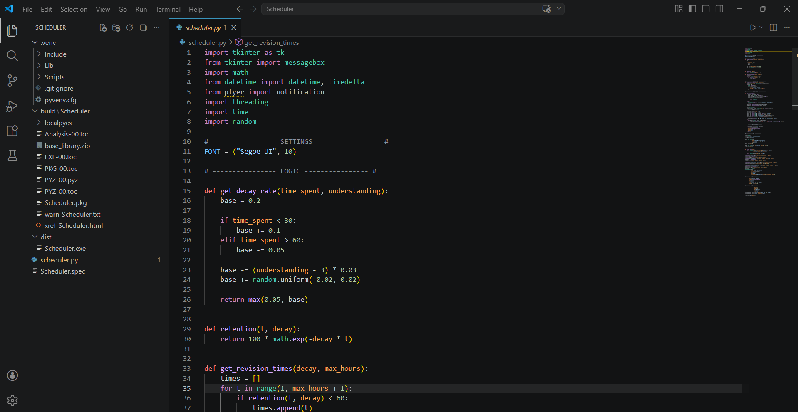
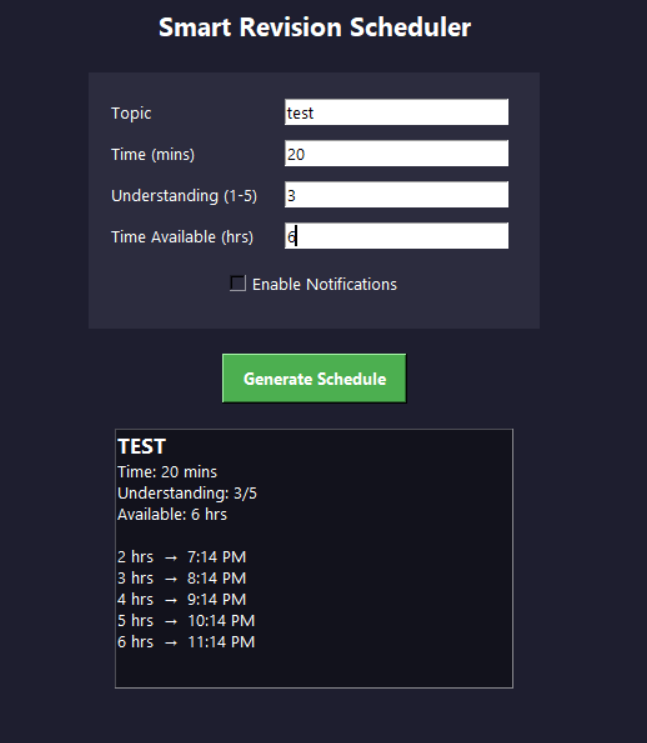

# 🧠 Smart Revision Scheduler

A Python-based desktop application that predicts optimal revision timings using memory decay logic and provides real-time desktop notifications for effective study planning.

---

## 📸 Project Preview

### 🔹 Code Overview


### 🔹 Application UI


---

## 📌 Features

- 📅 Predicts optimal revision timings using a memory decay model  
- 🧠 Adapts schedule based on user understanding level  
- ⏳ Generates revision plan within available time (deadline-based)  
- 🔔 Sends real-time desktop notifications for revision reminders  
- 🖥️ Clean and interactive GUI using Tkinter  

---

## ⚙️ Tech Stack

- **Python**
- **Tkinter** (GUI)
- **Plyer** (Desktop Notifications)

---

## 🧮 How It Works

The system is based on the concept of **memory decay**, where retention decreases over time.

- Uses an exponential decay function:
  
  `Retention = 100 * e^(-decay * time)`

- Decay rate is dynamically adjusted based on:
  - Study duration  
  - User understanding level  

- Generates revision times when retention falls below a threshold (e.g., 60%)

- Ensures all revision schedules fit within the user’s available time

---

## 🖥️ How to Run

### ▶️ Option 1: Run Python Code
```bash
python scheduler.py
🔗 Download & Run: https://github.com/Pallaini-Bhargavi/Smart-Revision-Scheduler/releases
